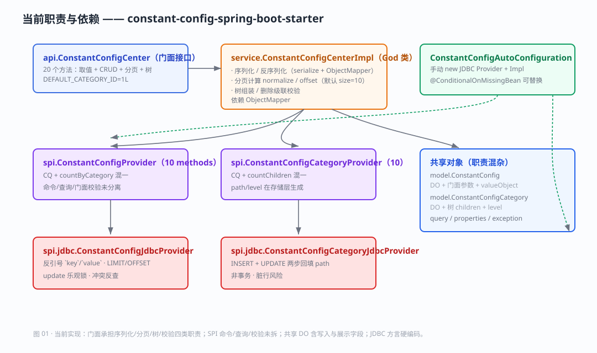
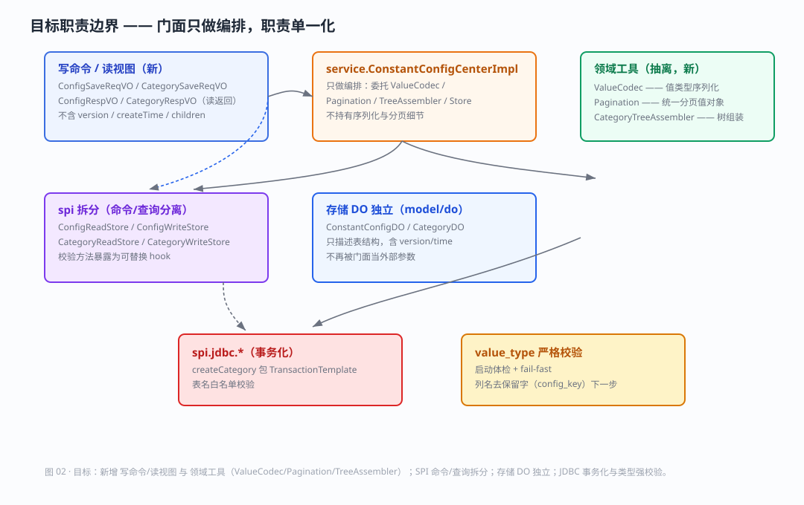

# 【常量配置中心】- 重构方案 -【v2.0】

> 范围：constant-config-spring-boot-starter 的职责边界重构（P1）+ 正确性修复（P0）+ 能力增强（P2）。
> 目标：**门面只做编排**、SPI 命令/查询分离、存储 DO 独立、跨库方言收敛、类型严格校验，并补齐事务化与（后续）缓存/事件。
> 交付方式：按批次实施，每一批次先评审后动手，不一次性堆代码。

---

## 一、结论

当前实现正确性较强（乐观锁 + DB 外键双层防护、异常体系清晰、测试覆盖 20+ 项），重构重心不在"修崩"，而在**消除职责混杂与接口过胖**，为后续缓存 / 事件 / 跨库扩展铺路。核心抓手三件：

1. **门面去 God**：序列化 → `ValueCodec`，分页 → `Pagination`，树组装 → `CategoryTreeAssembler`；
2. **SPI 拆读/写**：命令与查询方法分大小接口，降低自定义后端接入成本；
3. **对象职责单一**：`写命令` 与 `读视图` 与 `存储 DO`三者分离，解决 `valueObject` / `children` 常驻模型的混乱。

---

## 二、职责图

### 图 01 —— 当前职责与依赖

> 现状痛点：门面同时持有序列化 / 分页 / 树 / 校验四类逻辑；SPI 命令/查询/校验未拆；`ConstantConfig` 一身兼 DO、门面参数、write 载体三职；JDBC 方言（反引号、`LIMIT/OFFSET`）硬编码。

### 图 02 —— 目标职责边界

---

## 三、实施批次总览（每批可独立评审）

| 批次 | 内容 | 优先级 | 涉及文件 | 风险 |
| --- | --- | --- | --- | --- |
| B1 | 魔法值收敛 + `ValueType.of` 严格校验 | P0 | Properties、接口常量、枚举 | 低 |
| B2 | 表名白名单 + `createCategory` 事务化 | P0 | 两个 JDBC Provider | 低 |
| B3 | 抽取 `ValueCodec`（值类型序列化）| P1 | 新增 model/codec，改 Impl | 中 |
| B4 | 抽取 `Pagination`（统一分页）| P1 | 新增，改 Impl + Query | 中 |
| B5 | 抽取 `CategoryTreeAssembler`（树组装）| P1 | 新增，改 Impl | 低 |
| B6 | 拆分 `写命令/读视图` 与存储 DO | P1 | 新增 Command/View/DO，改门面与 SPI | 高（涉及 SPI 签名）|
| B7 | SPI 命令/查询接口拆分 | P1 | spi 接口 + JDBC 实现 | 中 |
| B8 | 列名去保留字 + 方言适配（立项）| P0 | DDL + SQL | 高（需 MVP 建表 + 迁移脚本）|
| B9 | 缓存 + 变更事件（增强）✅ 已实施 | P2 | 新增 cache/event | 中 |

> 依赖顺序：B1/B2 独立可先做打底；B3/B4/B5 互不影响，均依赖 B1 的魔法值收敛；B6 依赖 B3/B4；B7 依赖 B6；B8、B9 可并行，B8 建议单独立项评审。

---

## 四、各批次详细方案

### B1 · 魔法值收敛 + 值类型严格校验（P0）

**痛点**
- 默认分类 `DEFAULT_CATEGORY_ID=1L` 是门面接口常量（[ConstantConfigCenter.java](file:///d:/study/常量配置中心/Constant-Config-Center/src/main/java/com/constantconfig/center/api/ConstantConfigCenter.java#L39)）；分页默认 `size=10` 在 `ConfigPageReqVO`、`CategoryPageReqVO`、`Impl.normalizeSize` 三处重复；`version` 初始 `0`、`path` 形如 `/1` 散落 SQL。
- `ConstantConfigValueType.of()` 对未知字符串**静默回退 STRING**（[ConstantConfigValueType.java](file:///d:/study/常量配置中心/Constant-Config-Center/src/main/java/com/constantconfig/center/model/ConstantConfigValueType.java#L25-L34)），会掩盖脏数据。

**改动方向**
- 默认值收敛进 `ConstantConfigProperties`（新增 `defaultCategoryId` / `defaultPageSize` / `defaultVersion`），门面与实现统一从属性取，消除漂移点。
- `of(String, boolean failFast)`：启动时做一次数据体检，发现非法 `value_type` 日志告警；运行时 `get` 解析遇到非法值 fail-fast 抛 `ConstantConfigException`，不再静默降级。

**验收**：单测覆盖——新增属性可覆盖默认值；脏 `value_type` 能抛语义异常而非静默 STRING。

### B2 · 表名白名单 + `createCategory` 事务化（P0）

**痛点**
- `createCategory` 先 INSERT 再 UPDATE 回填 `path`（[ConstantConfigCategoryJdbcProvider.java](file:///d:/study/常量配置中心/Constant-Config-Center/src/main/java/com/constantconfig/center/spi/jdbc/ConstantConfigCategoryJdbcProvider.java#L99-L121)）两条 SQL 无事务，第二步失败留下 `path=''` 脏行。
- `table` / `categoryTable` 来自配置直接拼接进 SQL（[ConstantConfigJdbcProvider.java](file:///d:/study/常量配置中心/Constant-Config-Center/src/main/java/com/constantconfig/center/spi/jdbc/ConstantConfigJdbcProvider.java#L71)）。

**改动方向**
- 用 `TransactionTemplate`（或 `@Transactional`）包裹两步写，失败整体回滚。
- 注入 `TransactionTemplate`，对表名做白名单/格式正则校验（仅允许 `[a-zA-Z_][a-zA-Z0-9_]*`），其余参数一律走 `?` 占位。

**验收**：模拟第二步 UPDATE 异常时，库里不留脏行；非法表名启动即报错。

### B3 · 抽取 `ValueCodec`（P1）

**痛点**：值类型序列化/反序列化内聚在 `ConstantConfigCenterImpl.serialize()`（[ConstantConfigCenterImpl.java](file:///d:/study/常量配置中心/Constant-Config-Center/src/main/java/com/constantconfig/center/service/ConstantConfigCenterImpl.java#L210-L228)），门面持有领域规则。

**改动方向**：新增 `ValueCodec`（构造注入 `ObjectMapper`），提供 `encode(Object, valueType)` / `decode(String, TypeReference)`（含 `String` 快速路径与异常封装），门面委托之，不再直接碰 `ObjectMapper` 与 `JsonProcessingException`。

### B4 · 抽取 `Pagination`（P1）

**痛点**：`normalizePage/normalizeSize/offset`（[Impl L230-L236](file:///d:/study/常量配置中心/Constant-Config-Center/src/main/java/com/constantconfig/center/service/ConstantConfigCenterImpl.java#L230-L236)）是分页知识，且默认 `size` 三处漂移。

**改动方向**：新增 `Pagination` 值对象（`page/size/offset` + 静态 `of`），由 query 构建而成，统一负责 clamp 与默认值（默认值取自 Properties）。门面不再手写分页计算；SPI 的 `listPage` 接收 `offset/limit` 或 `Pagination`。

### B5 · 抽取 `CategoryTreeAssembler`（P1）

**痛点**：`listCategoryTree` 的两遍组装逻辑在门面（[Impl L187-L203](file:///d:/study/常量配置中心/Constant-Config-Center/src/main/java/com/constantconfig/center/service/ConstantConfigCenterImpl.java#L187-L203)）。

**改动方向**：抽纯函数式工具 `CategoryTreeAssembler.assemble(List<CategoryRespVO>)`，可单测；门面只调用。

### B6 · 写命令 / 读视图 / 存储 DO 分离（P1，联动最大）

**痛点**（[ConstantConfig.java](file:///d:/study/常量配置中心/Constant-Config-Center/src/main/java/com/constantconfig/center/model/ConstantConfig.java)）
- `valueObject` 纯写入载体常驻模型；`children`、`level`/`version`/`createTime` 对调用方是噪音；DO、门面参数、写载体三职一体。

**改动方向**
- 新增 `ConfigSaveReqVO` / `CategorySaveReqVO`：写操作入参，不含 `version`、`createTime/updateTime`、`children`，`valueObject` 归并进 `value` 或命令自身。
- 新增 `ConfigRespVO` / `CategoryRespVO`：读操作返回（配置视图不含内部字段；分类视图含 `children` 但剥掉存储字段）。
- 原 `ConstantConfig` / `ConstantConfigCategory` 收敛为存储 DO（`model/do`），仅 SPI 内部使用。
- 门面、Reader 使用 View/Command，SPI 使用 DO，门面负责 Command→DO 映射。

> 本批 是 B7 前置，影响 SPI 签名，**必须单独评审、单独跑回归**（现有 20+ 集成用例是最佳护栏）。

### B7 · SPI 命令/查询接口拆分（P1）

**方向**：`ConstantConfigProvider`（10 方法）→ `ConfigReadStore`（get/listPage/count…）/ `ConfigWriteStore`（create/update/delete）；分类同理。门面校验用统计方法（`countChildren`/`countByCategory`）归属查询侧或独立 hook。降低自定义后端接入成本（只用读或只用写无需实现全部）。

### B8 · 列名去保留字 + 方言适配（P0，立项）

**方向**：根因是 `key`/`value` 撞保留字。优先改列名 `config_key`/`config_value`（需 DDL + 迁移脚本 + 全量 SQL 替换，属破坏性变更，单独立项评审）。若不动列名，则引入方言适配层（引用/分页占位符）。附带 `AUTO_INCREMENT`/`NOW()` 的方言收敛。

### B9 · 缓存 + 变更事件（P2，增强）✅ 已实施

**方向**：读取侧加内存缓存（TTL + 显式失效），写操作发布 Spring Event（`ConfigChangedEvent`/`CategoryChangedEvent`），支持跨服务监听。

**缓存实现**（自研 `ConstantConfigCache`，`ConcurrentHashMap` + TTL，零新增依赖）
- 范围：仅「单点读」——配置按 `key`（`getConfig`/`getConfig(typeRef)`）、按 `config_name` 反查 `key`、以及「分类树」（`listCategoryTree` 的全部分类源）；列表 / 分页刻意不缓存（失效粒度粗、易脏读）。
- 容量超限：停止写入新缓存，读回源 DB；不做负缓存，规避「未命中 vs 值为空」二义性。
- 可整体替换：`@ConditionalOnMissingBean(ConstantConfigCache.class)`；`cache-enabled=false` 时门面经 `ObjectProvider` 取空退化为直读 DB。

**变更事件**（`event` 包，对齐 yudao `ApplicationEvent` 风格）
- `ConfigChangeType`（`CREATED`/`UPDATED`/`DELETED`）+ `ConfigChangedEvent`（key/configName/type）+ `CategoryChangedEvent`（categoryId/type）。
- 门面写成功后发布；本地 `CacheInvalidationListener` 消费并失效缓存。

**一致性策略**（关键）
- 配置**更新**：值/名称可能变化且旧名称不可预判，整体失效双索引（`clearConfig`）；`CREATED`/`DELETED` 按 key（+ 尽量回填的 configName）精确失效。
- `deleteConfig` 先回读 `config_name`，供失效「按名称反查 key」索引。
- 分类变更（增/删/改）：整体失效分类树。
- TTL 兜底：跨服务实例 / 直插 DB 不经本机事件，靠 TTL 收敛脏读窗口。

**新增属性**：`cache-enabled`（默认 true）· `cache-ttl-seconds`（默认 300）· `cache-max-size`（默认 1000）。

**测试**：新增 `ConstantConfigCacheTest`（4 项）断言「读回填 / 更新、删除、分类新增失效」，连同既有集成测试共 27 项全绿。

> 注：原方案标注「本期仅立项」；现本批次已落地实现，事件 / 缓存均保持 SPI 整体替换语义不变。

---

## 五、建议落地顺序

| 顺序 | 动作 |
| --- | --- |
| 1 | B1、B2（低风险打底，先跑通回归）|
| 2 | B3、B5（ValueCodec、TreeAssembler，纯抽取不改 SPI 签名）|
| 3 | B4（Pagination，微调 SPI listPage 入参）|
| 4 | B6（命令/视图/DO 分离，含 SPI 签名变更，重点评审 + 回归）|
| 5 | B7（读/写接口拆分，基于 B6）|
| 6 | B8、B9（立项，单独评审）|

> 每一步以 `mvn -Dtest=* test`（starter）和 yudao 内 19~23 项集成用例为验证基线；全部通过才算该批次完成。

---

## 六、不做的事（明确边界）

- 不改现有 SPI 可扩展语义（`@ConditionalOnMissingBean` 整体替换仍成立）。
- 不引入 MyBatis / JPA（保持 starter 轻量，JDBC 直查）。
- 不破坏现有 `ConstantConfigCenter` 对外调用习惯，除非 B6/B7 经用户签字确认。

---

## 七、v2.0 之后补充实施的内部收窄批次

以下为在既有 B1–B9 之上，经「可重构问题」再排查后补做的内部收窄项，均不改变对外 SPI / 门面签名与行为，回归 27 项全绿。

### R1 · 补丁合并规则上移门面（对应排查项 A1）
- **痛点**：`ConstantConfigJdbcProvider.update()` 承担「null 保留原值」的补丁合并，属写业务规则泄漏进存储实现，且每次更新 2 查。
- **改动**：门面 `updateConfig` 先读当前快照、在门面层完成非空覆盖合并，以**完整快照**交给写 SPI；存储层单条 `UPDATE ... WHERE key=? AND version=?` 直更 + CAS；`config_name` 冲突由 `uk_config_name` 唯一键拦截并翻译 `ConstantConfigConflictException`。涉及 [ConstantConfigCenterImpl.java](file:///d:/study/常量配置中心/Constant-Config-Center/src/main/java/com/constantconfig/center/service/ConstantConfigCenterImpl.java) / [ConstantConfigJdbcProvider.java](file:///d:/study/常量配置中心/Constant-Config-Center/src/main/java/com/constantconfig/center/spi/jdbc/ConstantConfigJdbcProvider.java) / [ConfigWriteStore.java](file:///d:/study/常量配置中心/Constant-Config-Center/src/main/java/com/constantconfig/center/spi/ConfigWriteStore.java)。

### R2 · 分页默认值收敛（对应排查项 C1）
- **痛点**：`ConfigPageReqVO` / `CategoryPageReqVO` 硬编码 `size=10`，与 `properties.defaultPageSize` 双漂移。
- **改动**：query `size` 默认置 `0`（未设置），由 `Pagination.of` 统一从 `properties` 兜底。涉及两个 PageQuery。

### 已核实暂不处理项
- **R3（排查项 B3，读侧 value_type 校验）**：核实后认定大部分已被 `ValueCodec.decode` 的 `ConstantConfigSerializationException` + 写侧 `encode` 强制 JSON 覆盖；剩余「STRING 列存合法 JSON、调用方主动结构化读」属按类型主动转换的特性，强行校验会收窄已文档化灵活路径，**本期放弃**。

### R4 · 门面层校验收敛（对应排查项 A2）
- **痛点**：`createConfig` / `updateConfig` 非空与外键校验缺失，空值落到 `NOT NULL` 列、坏分类落到外键约束，抛**裸** `DataIntegrityViolationException`；校验散落在 Provider。
- **改动**：门面层新增 `requireNotBlank` / `requireCategoryExists` 辅助，`createConfig` 断言 `key`/`configName`/`value` 非空并校验分类存在；`updateConfig` 断言 `key` 非空、显式新分类存在、显式 `configName` 非空。裸约束/外键异常统一前移为 `ConstantConfigException`。

### R5 · 缓存防御性拷贝（对应排查项 B1）
- **痛点**：`ConstantConfigCache` 直接缓存 Provider 返回的可变 DO / 列表，自定义 Provider 共享对象时存在被外部篡改污染的风险。
- **改动**：两个 DO 新增 `copy()`，`putConfigByKey/ByName/putCategoryAll` 写入前逐字段拷贝为新快照；读取路径不加拷贝、不增热路径开销。

### R6 · 删除分类原子化（对应排查项 B2）
- **痛点**：`deleteCategory` 先查后删非原子（get → countChildren → countByCategory → delete），配置预读与删除间可插空。
- **改动**：去掉 `countByCategory` 预读，分类下配置存在性由外键 `fk_ccc_category_id(ON DELETE RESTRICT)` 在 DELETE 时原子拦截并翻译为 `ConstantConfigException`；子分类预检保留（表结构无自引用外键，无法靠 FK 兜底）。